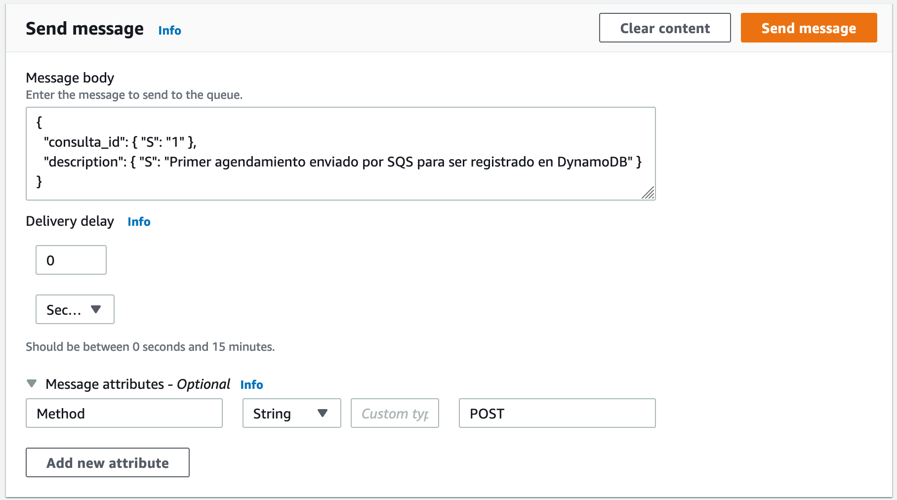
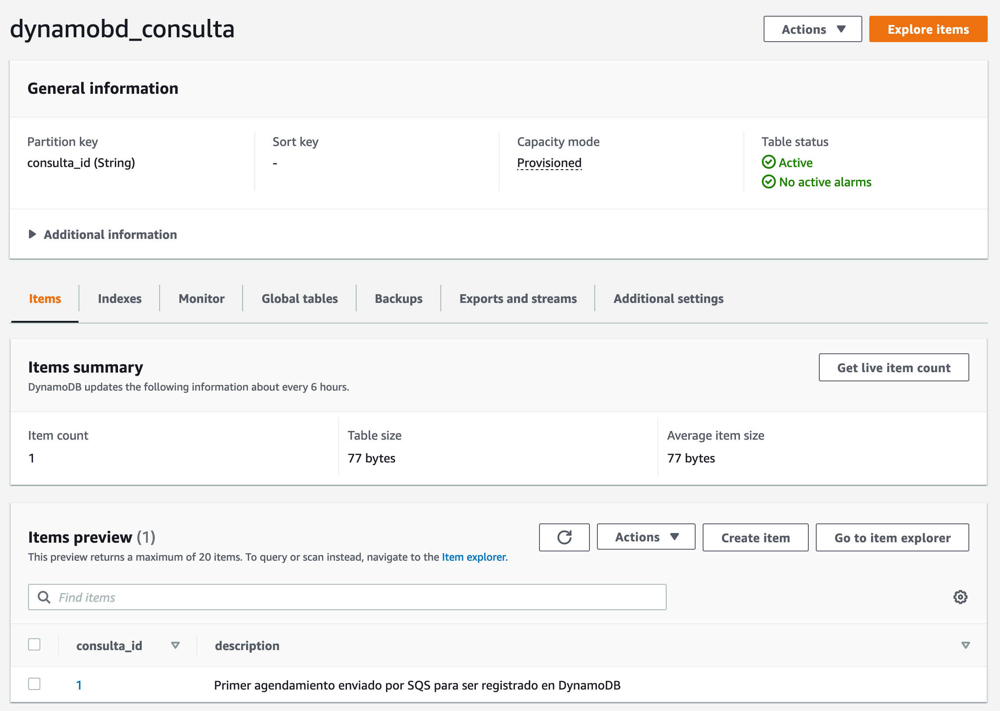

# AWS - SQS, Lambda and DynamoDB example

Following this repository you will get a SQS queue, a Lambda and a DynamoDB table. The data sent to SQS queue will go through the Lambda, the Lambda receives the message and will be responsible to put the message information in the DynamoDB table.

**Data --> AWS SQS --> Message --> AWS Lambda --> DynamoDB**

## Instructions

1. Follow [this tutorial](https://hevodata.com/learn/connect-sqs-to-dynamodb-2-easy-steps/).
2. Create an environment variable called `DYNAMODB_TABLE`. Set the **DynamoDB table name** as a value.
3. Copy the content of [lambda-dynamodb-crud.py](https://github.com/juanalvarez123/aws-sqs-lambda-and-dynamodb-example/blob/master/lambda-dynamodb-crud.py) in the lambda. Deploy it.
4. Send the message in the SQS.

## SQS message example

Message body:
```bash
{
  "consulta_id": { "S": "1" },
  "description": { "S": "Primer agendamiento enviado por SQS para ser registrado en DynamoDB" }
}
```

Message attributes:
```bash
"Method": "POST"
```

Example:


## DynamoDB data

This is how the message is stored in the table:

